# Quick Start Coding Guide

This guide will walk you through one way to get your first Battlesnake running, using a [pre-built starter project](../references/starter-projects.md) and [Replit](https://replit.com/) as your development environment and web server host. You will need:

* A free [**Battlesnake Account**](https://play.battlesnake.com/)
* A free [**Replit Account**](https://replit.com/)

If you do not wish to use Replit, you are welcome to use your own IDE, or any [hosting solution](../references/hosting-suggestions/) of your choosing.

## How does it work?

Developers build and deploy a web server that implements the [Battlesnake API](../references/api/). When a game is created, the game engine will make HTTP requests to your Battlesnake server, sending game board information and asking for your next move. Your Battlesnake's behavior is determined by how you program it to respond to these requests.

You can use any programming language, cloud platform, and strategy you want - from simple game logic to machine learning and AI.

## Step 1: Select a Starter Project

There are several community-built and supported starter projects for most popular languages and technologies. Each one is documented with detailed development and deployment instructions. It's possible to use most programming languages, but some will be easier than others.

You can choose from the complete list of [Starter Projects](../references/starter-projects.md), or use a Replit quick-link below to automatically clone an officially supported starter project and open it in your Replit account.


**Tip:** If you're unsure what language to choose, we suggest starting with [JavaScript](https://github.com/BattlesnakeOfficial/starter-snake-node) or [Python](https://github.com/BattlesnakeOfficial/starter-snake-python) as they're both widely supported and popular in the Battlesnake community.


* [Open the Python Starter Project in Replit](https://repl.it/github/BattlesnakeOfficial/starter-snake-python)
* [Open the Go Starter Project in Replit](https://github.com/battlesnakeofficial/starter-snake-go)
* [Open the JavaScript Starter Project in Replit](https://repl.it/github/BattlesnakeOfficial/starter-snake-javascript)
* [Open the TypeScript Starter Project in Replit](https://repl.it/github/BattlesnakeOfficial/starter-snake-typescript)
* [Open the Rust Starter Project in Replit](https://replit.com/github/BattlesnakeOfficial/starter-snake-rust)

All of the Official Starter Projects implement the full [Battlesnake API](../references/api/) with enough code to run a basic Battlesnake that moves in a random direction.



## Step 2: Customize your Battlesnake \(a little bit\)

To make sure everything works correctly when you deploy and run your Battlesnake for the first time, **make a small customization change**, such as the color of your Battlesnake. The `README.md` file in each Starter Project describes where the customization code can be found. Customization is set in the top level [**/** GET](../references/api/#the-battlesnake-api) command of the [Battlesnake API](../references/api/).

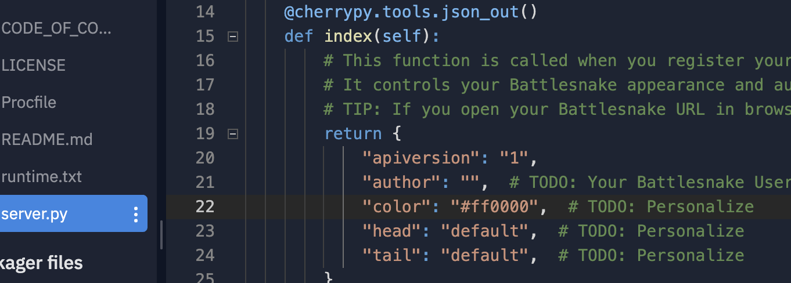

* [Python Starter Project Customization](https://github.com/battlesnakeofficial/starter-snake-python#changing-appearance)
* [Go Starter Project Customization](https://github.com/battlesnakeofficial/starter-snake-go#changing-appearance)
* [JavaScript Starter Project Customization](https://github.com/BattlesnakeOfficial/starter-snake-javascript#changing-appearance)
* [TypeScript Starter Project Customization](https://repl.it/github/BattlesnakeOfficial/starter-snake-typescript)
* [Rust Starter Project Customization](https://github.com/BattlesnakeOfficial/starter-snake-rust#customizing-your-battlesnake)

While color is a great place to start, Battlesnake also features an exciting collection of customizable heads and tails! All customization options are described in detail on the [Personalization Reference](../references/personalization.md) page.

After making changes to your Battlesnake, you can restart your Replit to have the change take effect \(or in many cases your Replit will restart automatically\).



## Step 3: Deploy and run your Battlesnake

Replit can act as both our development environment and web server host. To run your Battlesnake within Replit, click the **Run** button at the top of the screen.

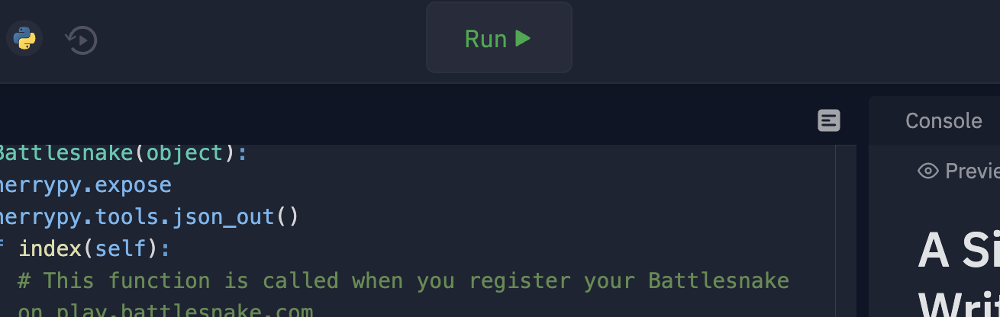

After clicking the **Run** button, you should see all libraries and dependencies being installed in the Replit console window, which may take a few moments. Once installation is complete, your Battlesnake server will start. You should see the live output from your Battlesnake server and the URL at the top.

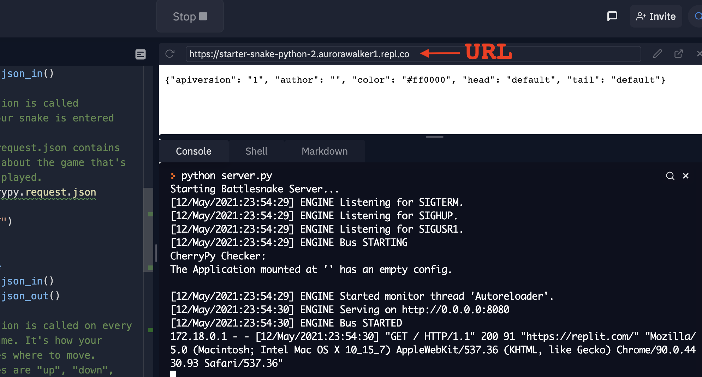


You will need your Battlesnake server URL later in Step 3 when registering your Battlesnake!


The output should match whatever configuration changes you made in Step 2. For example, if you changed your Battlesnake to be red, with the hex color value `#ff0000` then your output should look like this:

```text
{"apiversion": "1", "author": "", "color": "#ff0000", "head": "default", "tail": "default"}
```

This means that your Battlesnake is up and running correctly on Replit!

Replit is a fast and free option for hosting your Battlesnake server, but you can use whatever you like to run your server. For more options and information about hosting, check out [Hosting Suggestions](../references/hosting-suggestions/).


Tip: Keeping Replit open in a second window while games are running is helpful for watching server activity and debugging any problems with your Battlesnake.




## Step 4: Register your Battlesnake

Once your Battlesnake has a working URL, you can register it on the Battlesnake website and start playing games. You only need to register a Battlesnake once, and can continue to update and change your Battlesnake code after registering.

Battlesnake registration happens in your profile. **Copy the Battlesnake server URL from Replit** \(see Step 2\) and put it in the 'URL' field. You can also fill in extra details such as 'Description' and 'Tags' to tell us a bit about your Battlesnake.

[**Click here to Register a new Battlesnake in your account.**](https://play.battlesnake.com/account/snakes/create/)\*\*\*\*

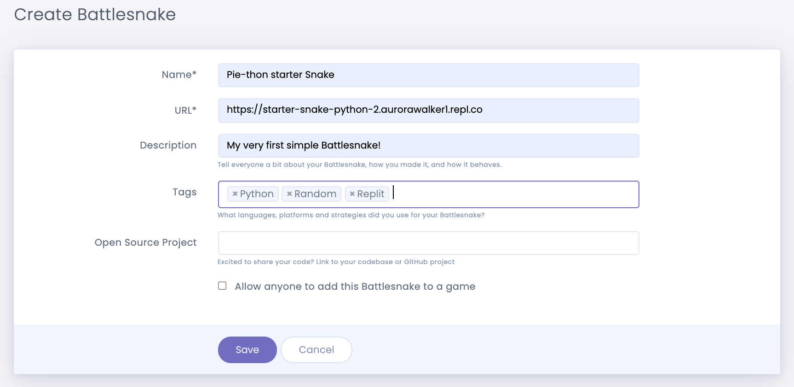

If you want your Battlesnake available for games with other people, you will need to check the _Allow anyone to add this Battlesnake to a game_ option. If you leave this unchecked, your Battlesnake will only be available for games that you create or are a part of an official Battlesnake Tournament or Arena.

If everything is setup correctly, your Battlesnake should show as operational with the color, head, and tail you set in your code. Some additional information will also be displayed about the latency of communication between the game engine and your Battlesnake server.

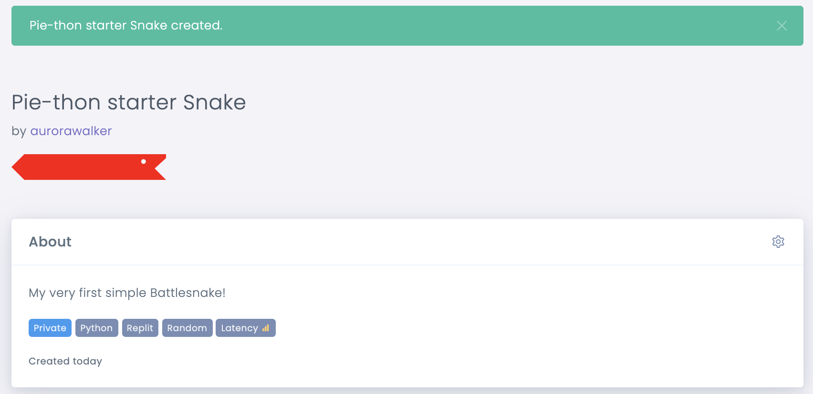


If there is a problem or error with your Battlesnake, you can make changes and then **Refresh** your Battlesnake on the main profile page, or via the gear icon on the Battlesnake page.


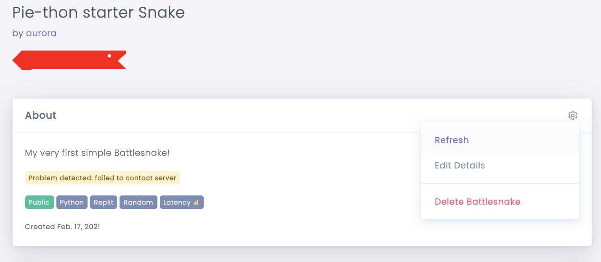

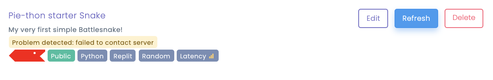

## Step 5: Create your First Game

You are now ready to test your Battlesnake in live games! So far, your Battlesnake has a sharp new look, but only moves in a random direction. This means that for your first game, your Battlesnake is most likely going to collide with a wall or turn back in on it's own body. That's ok! We all have to start somewhere.

Here's how to create a new game:

* Go to [**play.battlesnake.com**](https://play.battlesnake.com)
* From the navigation menu, choose [**Create Game**](https://play.battlesnake.com/account/games/create/)

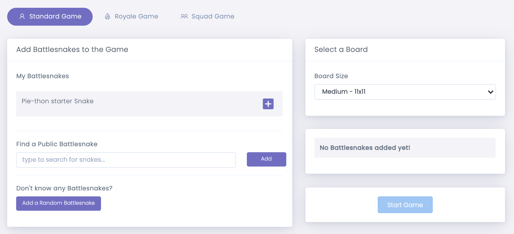

* Click the ➕ next to your Battlesnake to add it to the game


**Tip:** You can also add other Battlesnakes to your game, either by searching for them by name or using the 'Add a Random Battlesnake' button. Only Battlesnakes that check off the _Allow anyone to add this Battlesnake to a game_ option \(Step 3\) will appear in public search.


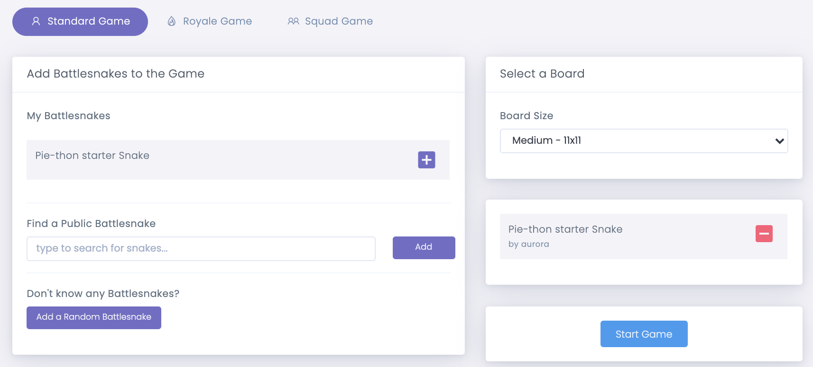

* Click on **Start Game** button to start the game

You will be rewarded with a view of the game board that includes your Battlesnake and any other Battlesnakes you added to the game. Click the ▶ button to start the game and watch your Battlesnake in action. You can also use the **\|◀** and ▶**\|** buttons or the arrow keys on your keyboard to step through the game, move by move. This can be very helpful when reviewing your server logs for each turn!

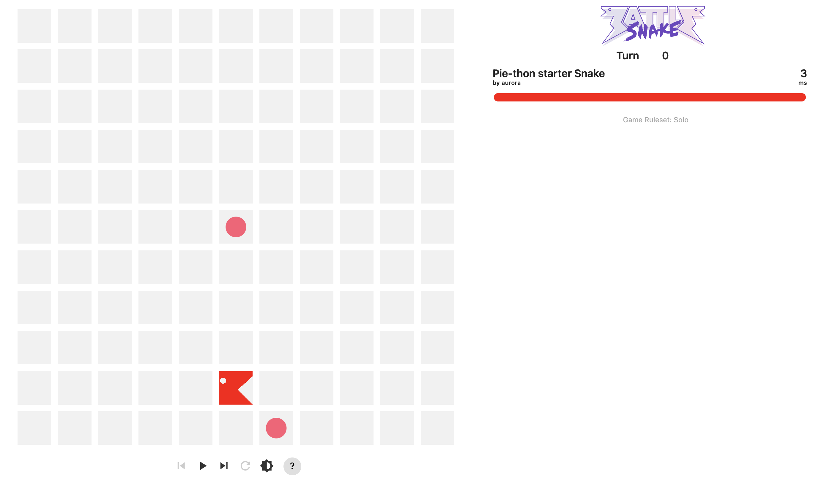

At the bottom of the game board is extra information about the game and additional controls. To quickly create a new game with the same configuration, click the **Create Rematch** button. There are also other options _\*\*_to share and save the game as a favourite.

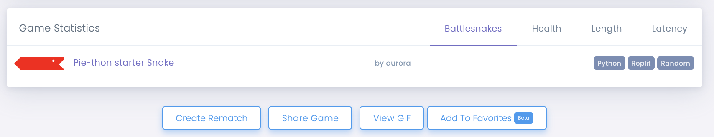

**Congratulations, you've built and deployed your first Battlesnake!** 🎊\*\*\*\*

## Step 6: Better than Random

At this point you're ready to start making your Battlesnake smarter. Here are some initial goals to help you develop your Battlesnake. Completing these will make your Battlesnake competitive against other Battlesnakes in multi-player games.

1. Avoid colliding with walls
2. Avoid colliding with yourself
3. Avoid colliding with other snakes
4. Try to move towards food

Typical Battlesnake development looks like:

1. Decide how you want to your Battlesnake to move in a specific situation
2. Program your Move Command accordingly
3. Deploy your changes to your web server
4. Create new games and test your new behaviour
5. Repeat until undefeated

The [**/move**](../references/api/#move) command in the API is where your Battlesnake decides which direction it is going to move. This can be found in the following places for each of the Official Starter Projects:

* [Python Starter Project - `handle_move()` function inside of server.py](https://github.com/BattlesnakeOfficial/starter-snake-python/blob/master/server.py#L37)
* [Go Starter Project - `HandleMove()` function inside of main.go](https://github.com/BattlesnakeOfficial/starter-snake-go/blob/master/main.go#L95)
* [JavaScript Project - `move()` function inside of logic.js](https://github.com/BattlesnakeOfficial/starter-snake-javascript#changing-behavior)
* [TypeScript Starter Project - `move()` function inside of logic.ts](https://github.com/BattlesnakeOfficial/starter-snake-typescript#changing-behavior)
* [Rust Starter Project - `get_move()` function inside of logic.rs](https://github.com/BattlesnakeOfficial/starter-snake-rust#changing-behavior)

On every turn of the game, the Battlesnake Engine makes a call to your Battlesnakes **/move** command with data that describes the current state of the board, including its size, the location of food, the locations of other Battlesnakes, and other important game data. The [API Reference](../references/api/) has a [**sample JSON object**](../references/api/sample-move-request.md) that contains this data.

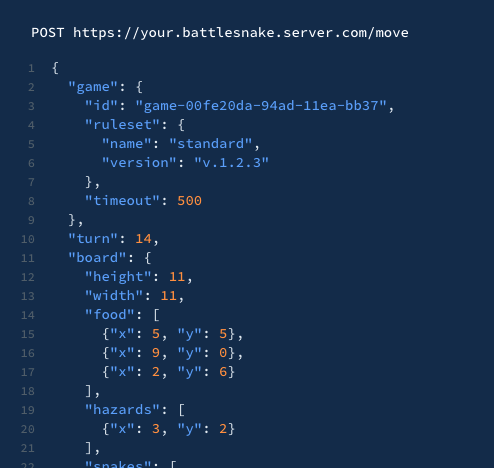

In the unmodified Official Starter Projects, the **/move** command accepts this JSON data, and then with absolutely no regard for self-preservation, responds with a move in a random direction, one of 'left', 'right', 'up' or 'down'. By changing the code in your projects `move()` function, you can better control how your Battlesnake behaves.

We recommend starting simple - start by adding rules that prevents your Battlesnake from turning back on its own neck, or running head-first into a wall. There is a series of [**Training Program Challenges**](https://play.battlesnake.com/challenges/) that can act as your guide and help you track progress as you train up your Battlesnake. The secret is to make small changes and then immediately test.

**For details on how /move and other command work**, we recommend reading through the code in the [Battlesnake API Reference](../references/api/).





## Coding Resources

This guide has helped you build and deploy your first Battlesnake using [Replit](https://replit.com/) and an [Official Starter Project](../references/starter-projects.md), and has reviewed the steps necessary to get it registered in your Battlesnake account and running your very first games.

But this only scratches the surface!

Check out the [Battlesnake Game Rules](../references/rules.md) and [Tips & Tricks](tips.md) guide to make sure you understand how to program your Battlesnake to win the most games possible. You may have also noticed there are different [Game Modes ](../references/game-modes.md)to explore that provide different challenges for your Battlesnake.







You can also check out the [Battlesnake Awesome List](https://github.com/xtagon/awesome-battlesnake), built by [Xtagon](https://play.battlesnake.com/u/xtagon/) and maintained by the community for great Battlesnake resources. Anyone may [contribute](https://github.com/xtagon/awesome-battlesnake/blob/master/CONTRIBUTING.md), so if you know of any interesting resources or wish to share your own creations, [open a pull request](https://github.com/xtagon/awesome-battlesnake/pulls).

**Good luck, and happy programming!**

\*\*\*\*

