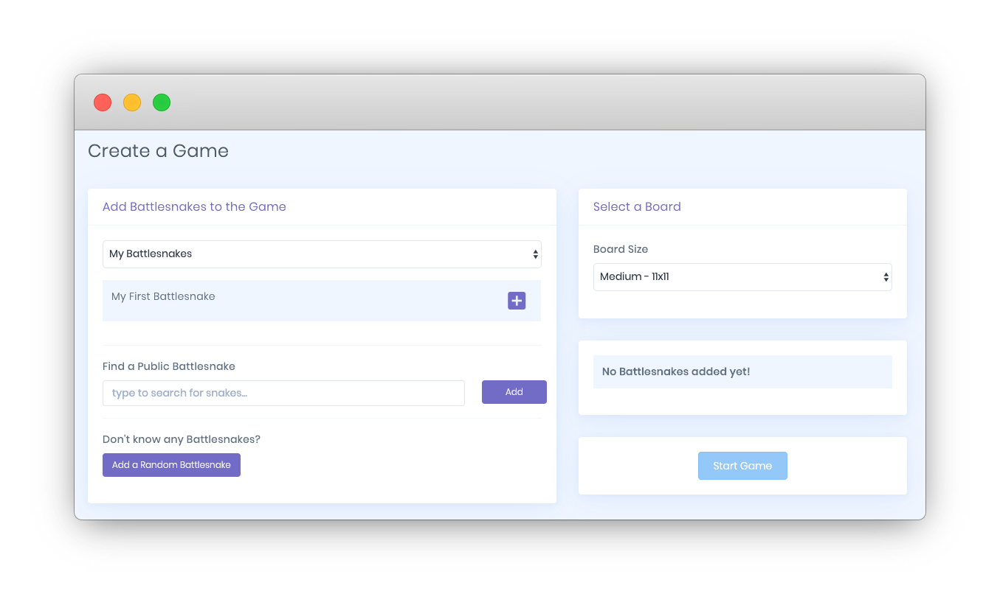
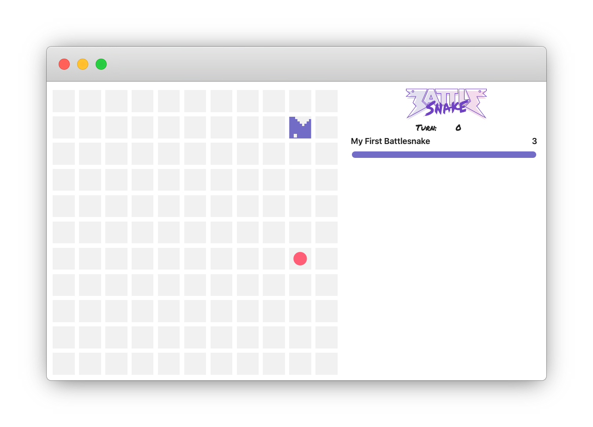

# Getting Started

At its core **Battlesnake is an autonomous survival game.** Each Battlesnake moves independently around the game board in an attempt to find food, avoid each other, and avoid elimination.

Anyone can compete and win, and success at the highest level requires unique strategies combined with excellent programming.

## What is a Battlesnake exactly?

A Battlesnake is a programmed web server that implements the [Battlesnake API](../references/api.md) to play the game. When a game is running, the game engine will make HTTP requests to your Battlesnake server, sending game board information and asking for your next move.

How your Battlesnake moves during the game is decided by how you program it to respond to these requests. Since your Battlesnake is just a live web server, you can use any languages and technologies you want - from simple game logic, to machine learning and AI.

**Every Battlesnake needs to do two things in order to play the game:**

1. Implement the [Battlesnake API](../references/api.md)
2. Be deployed to the internet and accessible by URL

This guide will help you accomplish those steps, register your Battlesnake, and create live games to test your logic.

## Battlesnake Starter Projects

The Battlesnake community has built some open source projects to get you started. They serve as great starting points, and each one is documented with detailed development and deployment instructions.




**Tip:** We suggest selecting a Starter Project early and following along with this guide, referring to the project code for implementation details.


## Step 1: Program Your Battlesnake

First you'll want to decide what technologies to use to build your Battlesnake. We suggest selecting a programming language you're already familiar with.

Python, JavaScript, and Ruby are popular choices. It's possible to use most programming languages, but some will be easier than others.


**Tip:** If you're unsure what language to choose, we suggest starting with [JavaScript](https://github.com/BattlesnakeOfficial/starter-snake-node) or [Python](https://github.com/BattlesnakeOfficial/starter-snake-python) as they're both widely supported and popular in the Battlesnake community.


### Implementing the Battlesnake API

The Battlesnake API consists of four commands. These commands are called at different times during each game and your response to these command controls how your Battlesnake appears and behaves on the game board. 

All four commands are summarized here, and the [Battlesnake API Reference](../references/api.md) has complete details for each command.

\*\*\*\*[**Command: Get Battlesnake**](../references/api.md#undefined)  
This command is called periodically by the game engine and the Battlesnake platform. It should return information about your Battlesnake, including what color it is and what its head and tail should look like.

\*\*\*\*[**Command: Start Game**](../references/api.md#start)  
This command is called once at the beginning of every game to let your Battlesnake know that a new game is about to start.

\*\*\*\*[**Command: Move**](../references/api.md#move)  
This command is called once per turn of each game, providing information about the game board to your Battlesnake and asking for its next move. Your response to this command determines how your Battlesnake behaves and will be the primary focus of your game logic programming.


**Tip:** We recommend starting out by hardcoding your Battlesnake to move in a specific direction, such as "left" or "right". This will let you make sure your server is working correctly before implementing more complex logic.


\*\*\*\*[**Command: End Game**](../references/api.md#end)  
This command is called once after each game has completed to let your Battlesnake know that the game is over.

**For details on how each command works**, we recommend reading through the code in the [Starter Projects](../references/starter-projects.md) and the [Battlesnake API Reference](../references/api.md).



## Step 2: Deploy Your Battlesnake

Once you've programmed your Battlesnake to implement the API, it must be deployed to a publicly accessible web server. This can be done using a cloud hosting provider such as [Heroku](https://www.heroku.com/) or [Amazon Web Services](https://aws.amazon.com/). Many of these services provide a free tier for new accounts.

Most of the [Starter Projects](https://docs.battlesnake.com/starter-snakes) have instructions for deploying quickly to Heroku, which is a great option if you are new to web development or uncomfortable deploying code to a live server on your own.

Successfully deploying your Battlesnake should provide you with a unique URL. Opening that URL in a browser should show your Battlesnake in action!


```text
{"apiversion": "1", "author": "BattlesnakeOfficial"}

```


## Step 3: Register Your Battlesnake

Once your Battlesnake is operational and you have its URL, you can register it on the Battlesnake website. Click on the button below to setup a new snake.

[Click here to Register a new Battlesnake in your account.](https://play.battlesnake.com/account/snakes/create/)

If everything is setup correctly, your Battlesnake should show as operational with the appropriate color, head, and tail. Some additional information will be displayed about the latency of communication between the game engine and your Battlesnake server.

## Step 4: Create Your First Game

You are now ready to test your Battlesnake in live games! Here's how to create a new game:

* Go to [**play.battlesnake.com**](https://play.battlesnake.com)\*\*\*\*
* From the navigation menu, choose [**Create Game**](https://play.battlesnake.com/account/games/create/)\*\*\*\*



* Click the ➕ next to your Battlesnake to add it to the game


**Tip:** You can also add other Battlesnake to your game, either by searching for them by name or using the 'Add a Random Battlesnake' button.


* Click on **Start Game** button to start the game

You will be rewarded with a view of the game board that includes your Battlesnake and any other Battlesnakes you added to the game. Click **Play** to start the game and watch your Battlesnake in action.



## Next Steps

**Congratulations, you've built and deployed your first Battlesnake!**  🎊\*\*\*\*

At this point you're ready to start making your Battlesnake smarter and more competitive. Typical Battlesnake development looks like:

1. Decide how you want to your Battlesnake to move in a specific situation
2. Program your Move Command accordingly
3. Deploy your changes to your web server
4. Create new games and test your new behaviour
5. Repeat until undefeated

We suggest reading the [Battlesnake Game Rules](../references/rules.md) and [Tips & Tricks](tips.md) guide to make sure you understand how to program your Battlesnake to win the most games possible.





You can also check out the [Battlesnake Awesome List](https://github.com/xtagon/awesome-battlesnake), built and maintained by [Xtagon](https://play.battlesnake.com/u/xtagon/), for great Battlesnake resources.

**Good luck, and happy programming!**

## **Looking for more?**

