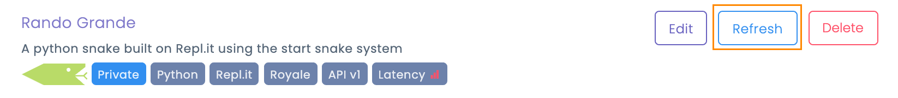

# Migrating to API Version 1

### Overview

As of December 31st, 2020 the original implementation of the Battlesnake API, known as Version 0, will no longer be supported on the Battlesnake platform. Battlesnakes still implementing that version are no longer able to create games, enter arenas or participate in competitions. 

Upgrading a Battlesnake to API Version 1 is a simple process that involves 4 steps, outline below.

### Step 1: Implement Root Endpoint

The old `POST /ping` endpoint is now deprecated and can be removed from your Battlesnake.  Instead, Battlesnakes must implement a new `GET /` endpoint that will return metadata about the Battlesnake. This is now how snakes can be customized and where they will will identify their supported API version.  

```text
{
    "apiversion": "1",
    "author" : "my_user_name",
    "color": "#888888",
    "head" : "default",
    "tail": "default"
}
```

### Step 2: Update /Start Endpoint

Any customization data in the `POST /start` endpoint is ignored by the game engine for API Version 1 Battlesnakes. You can remove any payload your are currently sending in response to a the `/start`  request. All customization of your snake is now handled in the Root Endpoint \(see above\) 

### Step 3: Update Coordinate System to Invert Y-Axis

Battlesnakes that implement the API Version 1 will receive the board data with a coordinate system origin \(0,0\) located in the bottom left corner of the board. In API Version 0, the coordinate system origin was in the top left corner of the board. You will either need to invert your logic with respect to the y-axis or your snake may move in unexpected ways. 


### Step 4: Refresh Your Battlesnake

Once your Battlesnake code is updated and deployed, go to [play.battlesnake.com](https://play.battlesnake.com/me) and use the _Refresh_  button to update your Battlesnake's metadata and upgrade it to API version 1. 



If you have implemented your index command correctly, you should immediately see your Battlesnake appear along with the `API v1` tag and a `Latency` tag that show the ping time of your snake.  Anytime you make changes to your snakes customizations you will need to refresh your Battlesnake so that the platform can load the new data.

