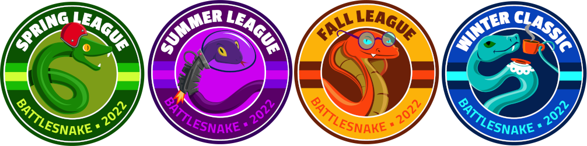

# League Guide

Battlesnake hosts several annual [online competitions](https://play.battlesnake.com/competitions/) called Leagues. A Battlesnake League is a special event that runs for several weeks and is open to developers all over the world. The long-running nature of League events allow for continuous updates and evolution of your Battlesnake code.

## What happens during a League?

### Pre-Registration Phase

When a League is announced, there is a pre-registration phase where participants can register for the League and start warming up their Battlesnake code in anticipation of the competition's start. Sometimes there are prizes for participants who sign up during this phase, so we recommend pre-registering whenever possible.


If this is your first time creating a Battlesnake, check out the [Quick Start Coding Guide](getting-started.md).


### League Start

When the League starts, participants will be able to enter their Battlesnake into one or more Ladders to compete. You will need to first [register a Battlesnake](https://play.battlesnake.com/account/snakes/create/) with your Battlesnake account, as explained in the [Quick Start Coding Guide](https://app.gitbook.com/s/-M76ZsDOynN6TRQo1L1E/guides/guides/getting-started.md).

The League Ladders will automatically run games in one or more of our possible [game modes](../references/game-modes.md). How many Ladders, and in which game mode depends on the League. All participants enter the Ladders at the bottom rung, and the system will automatically play games against other Battlesnakes in the ladder, tracking your Battlesnakes score as it rises up the ranks. We encourage you to make updates and changes to your Battlesnake as it competes. Progression in the Ladder is often rewarded with prizes, such as [custom heads and tails](https://play.battlesnake.com/references/customizations/) for your Battlesnake.

Registration for the League and the League Ladders will remain open up until a few days before the Tournament. Check the League Schedule for the exact dates for any specific League.

### Ongoing Special Content

Throughout the entire League there will be a variety of [Twitch Shows](https://www.twitch.tv/battlesnakeofficial) where tutorials, special content, and League news will be streamed. Keep an eye on the Schedule on the League page for what and when streams are happening.

You can see the complete Battlesnake schedule, with all Streams and Events on the [Community Calendar.](https://play.battlesnake.com/schedule/)

### Tournaments

At the end of the League, tournaments will be run and live-streamed on [Twitch](https://www.twitch.tv/battlesnakeofficial). Tournament placement is determined by rankings in the League Ladders. Tournaments have an additional prize structure posted on the Prizes section of the League page. Be sure to tune in to cheer on your Battlesnake!

### Technical Considerations

In order to do well in Leagues, you should have a Battlesnake that is capable of playing in multiple games at the same time.&#x20;

If your Battlesnake is also competing in [Battlegrounds](https://play.battlesnake.com/battlegrounds/), it may end up in both Battleground Ladder games and League Qualifying Ladder games at the same time. You can utilize the `Game.source` provided data in the [Battlesnake API](https://docs.battlesnake.com/references/api#game), to prioritize how to handle games from different sources.

## When is the next League?

The planned Leagues for the 2022 season are:

* [Spring League ](https://play.battlesnake.com/spring-league/)
  * Pre-Registration Opens January 28th 2022
  * February 11th - March 26th 2022
* [Summer League](https://play.battlesnake.com/summer-league/)&#x20;
  * Pre-Registration Opens June 3rd 2022
  * June 17th - July 30th 2022
* [Fall League](https://play.battlesnake.com/fall-league/)&#x20;
  * Pre-Registration Opens September 16th 2022
  * Sept 30th - Nov 12th 2022
* [Winter Championship](https://play.battlesnake.com/winter-classic/)
  * &#x20;December 2022

You can see the complete Battlesnake schedule on the [Community Calendar.](https://play.battlesnake.com/schedule/)

