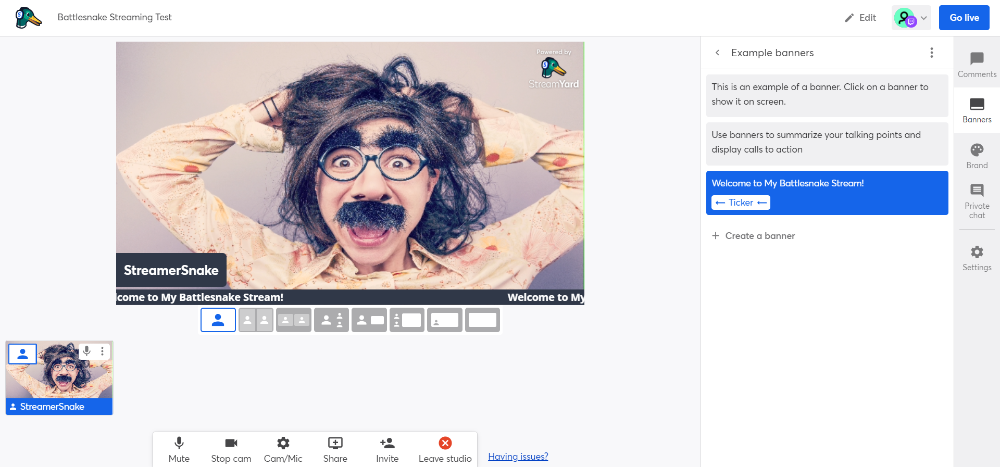

# Quick Start Streaming Guide

This guide will walk you through one way to get your first Battlesnake livestream running, using [Twitch ](https://twitch.tv)as the streaming service and [StreamYard ](https://stemyard.com)as your broadcasting studio.&#x20;

In addition to a [Chromium ](https://en.wikipedia.org/wiki/Chromium\_\(web\_browser\))based browser, you will also need:

* A free [StreamYard ](htps://streamyrd.com)Account​
* A free [Twitch ](https://twitch.tv)Account​

If you do not wish to use [StreamYard ](https://streamyard.com)and [Twitch](https://twitch.tv), you are welcome to use your own broadcasting software, or any streaming service of your choosing.

## How does it work? 

TLDR. Using only a [Chromium ](https://en.wikipedia.org/wiki/Chromium\_\(web\_browser\))browser, free web-based software and built-in peripherals on your device, you can get started with streaming about your Battlesnake experience today!&#x20;

## Step 1: Setup Your Twitch Channel 

First things first, in order to stream on [Twitch](https://twitch.tv) you will need an account, so head over to [https://www.twitch.tv/signup](https://www.twitch.tv/signup) and create your new account OR login to an existing account.

.png>)

Now that you are signed-in, whether you are a brand new streamer or just new to streaming Battlesnake, of the most important things you can do to help direct people to your Battlesnake content is to customize your channel by selecting the "Customize Channel" button.

.png>)

Once on the [Channel Settings](https://dashboard.tw/settings/channel) page, be sure to update at least the **About**, **Brand **and **Schedule **tabs with the relevant details that correspond with how you will be streaming about Battlesnake.

.png>).png>).png>).png>)

## Step 2: Setup Your Streaming Space 

While peripherals like green screens and condenser microphones are great additions to your streaming setup, to get started with Battlesnake streaming all you really need is:

* A solid internet connection (wired/ethernet connection is ideal);
* Streaming software (in our case StreamYard);
* A computer that will run your content;
* Audio and visual peripherals (i.e. webcam, microphone and headset).

If you are on a laptop and using built-in peripherals (i.e. the on-board microphone and camera) likely the only additional peripherals you will need is a headset!

While at this point you are almost ready to get started with your stream, below are a few useful tips to help you get your space ready for prime Battlesnake streaming:

* Ask any others who share your space to stay offline during your stream.
* Avoid having a window behind the speaker and ensure there is enough light.
* Tell people ahead of time when you're going to broadcast

## Step 3: Setup Your StreamYard Studio 

While streaming can use include more advanced software like [OBS](https://obsproject.com), [Streamlabs](https://streamlabs.com) and [xSplit](https://www.xsplit.com), one of the great things about [StreamYard](https://streamyard.com) is that it runs completely in your browser and is absolutely free!

**Even the Battlesnake team uses StreamYard for some streams!**

To get started with [StreamYard](https://streamyard.com), the first thing you will need to do is head over to [https://streamyard.com/signup](https://streamyard.com/signup) to create an account and receive your login code.

Once you have logged in, you will see the page below, where you can begin connecting your streaming channels, in the case of this guide by selecting the purple [Twitch](https://twitch.tv) button.


Did you land on the "Broadcasts" tab when you logged in? Be sure to switch over to the "Destinations" tab on the left hand side of the window.


.png>)

Once you have connected to Twitch, it's time to setup your first stream by selecting the "Create a broadcast" button, and filling in the relevant details in the popup modal.&#x20;

.png>)

Once you have entered all of the details, go ahead and select the "Create broadcast" button, this won't start your stream but it will allow for you to enter the [StreamYard](https://streamyard.com) Studio you will need.

Before moving forward you will need to grant access to the relevant camera and microphone and to add your name after, after which you should see the "Enter Studio" button appear.

.png>) .png>)

**Congratulations Battlesnake Streamer! You are almost ready to go live! **

****

But before you do, you will need to add a few things to your stream window, most importantly your camera and audio feeds along with your awesome Battlesnake content screen share.


Note: In the free version of StreamYard your stream customization options are limited; however, should you choose to upgrade Battlesnake can provide you with a custom Streamers Pack which is full of awesome graphics to make your stream even better.


.png>)

Adding your audio and video feed to the stream is easy, simply select your camera preview at the bottom of the StreamYard Studio window and you will be prompted to add it to the stream.


Hint: You can add custom banners, like the "Welcome to My Battlesnake Stream!" ticker we added below, by selecting banners on the right side of the studio setup screen.


Sharing your screen is almost as easy as your camera feed, simply select the "Share" button at the bottom of the Studio window and in the pop-up modal choose which screen you'd like to share.


While we strongly recommend multiple monitors for streaming, if that is not possible we try sharing only the specific Chrome Tab or Window where you have Battlesnake content.&#x20;


.png>)

Once you have your screen share ready, simply select it from the preview bar at the bottom of the window and decide how you would like to layer your content using the template provided.

.png>)

### Run of Show  

While there is no one right way to structure the flow of your first stream, we do have a general "Run of Show" which we think will help to make the experience goes smoothly for everyone watching.

1. Start the show with your camera off-screen/muted a screenshare of a "Starting Soon" Slide.
2. Wait a few minutes for viewers to arrive then replace "Starting Soon" with your camera feed.
3. After you have some viewers on the stream, share your screen again with the relevant content.
4. Before ending the stream, switch to a "Thank You" slide with your social information and links.


Important Note: While Twitch automatically records your streams and creates videos-on-demand (VOD), these recordings only last for a week, so be sure to use the [highlight tool](https://help.twitch.tv/s/article/creating-highlights-and-stream-markers?language=en\_US) so the stream VOD does not disappear from your channel.


## Step 4: Start your First Stream 

Once you have all of your streaming assets ready to go, your final step is to select the "Comments" tab on the right side of the Studio window so you are able to view the Twitch Chat and then you will be ready to press the "Go Live" button in the top right-hand corner of the Studio window.


Ensure you select the "Comments" tab NOT the "Private chat" tab, as the latter is only accessible to people using the StreamYard studio (i.e. yourself and any guests you invite)


.png>)

If everything has worked out, you will be able to head over to the connected Twitch Channel (probably on a secondary device) and see your content live on the channel.


Be aware that there will be a few second delay between your live video and what is shown on Twitch so you will need to pause when asking questions to the audience.


.png>)


If you are using media in your stream, remember that you must use copyright free audio and video sources, otherwise you risk a DMCA notice from Twitch. For more resources, related to the use of audio & video in your streams check out our [Streaming Resources](quick-start-streaming-guide.md#coding-resources).


## Step 5: Vary Your Stream Content

Just like we do on the official Battlesnake channel, we recommend that you consider varying your Battlesnake Stream content based on your audience and interest.

#### Some examples of stream content might include, but are not limited to, the following:

#### Game Replay

**Have you ever thought you would be an amazing eSports Shout caster?**

In the style of Snake Pit Live! this type of stream is a great way to showcase both your Battlesnake in action as well as some of your favorite battles of all time.

Check out an episode of Snake Pit Live! from the official Battlesnake Channel for inspiration:



#### Live Coding

**Do you enjoy live coding streams and might want to build your Battlesnake project in public?**

In the style of Coding Badly, this type of stream is an awesome way to showcase your skills as a developer and to help your fellow Battlesnake Developers in their learning process.&#x20;

Check out an episode of Coding Badly from the official Battlesnake Channel for inspiration:



#### Guest Interviews & Q\&As

**Would you like to ask other Battlesnake Developers about their strategy?**

In the style of Deep Learning, this type of stream is a great way to not only gain valuable skills and knowledge to improve your own Battlesnake in competition, but to help to build your following through shared marketing.&#x20;

Check out an episode of Deep Learning from the official Battlesnake Channel for inspiration:



## Streaming Resources 

In addition to this Quick Start guide, both [StreamYard ](https://streamyard.com)and [Twitch](https://twitch.tv) provide some great resources to help you become a better streamer:





There are also some great resources from other Live Coders to check out for tips and tricks like:





We also encourage you to check out some of our favorite Battlesnake streamers like:





#### Using Media on Stream

In order to avoid Digital Millennium Copyright Act (DMCA) notices from the Twitch team for using media which is under copyright, you can use audio from a few great free sources including:







Also note that sharing audio is a bit more difficult that on some video sharing platforms, as StreamYard won't allow you to share audio from your screen share. To learn how you can share custom audio sources as part of your stream, check out the video from StreamYard below:



#### Are you streaming about Battlesnake on Twitch? 🎥

Fill out this form to let us know, & so we can send you some Battlesnake Swag for the stream.
