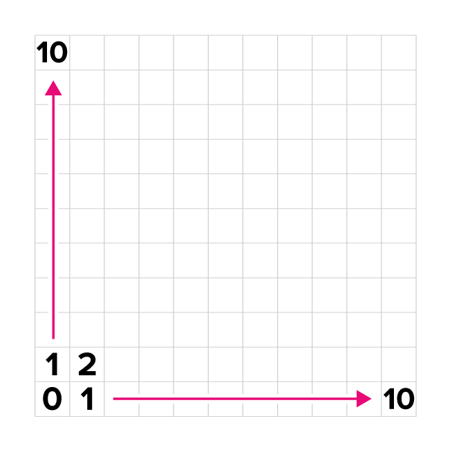

# API Reference

## Introduction

The Battlesnake API is an HTTP Webhook API, meaning developers build a web server that implements this API and the game engine will act as an API client during each game. How your server responds to these requests controls how your Battlesnake behaves.

Requests sent to your Battlesnake will be [JSON-encoded](https://www.json.org/), using standard HTTP request methods and content types.

### HTTP Response Codes

All Battlesnake API requests must return a valid _HTTP \`200 OK\`_. If any other status code is returned, the game engine will consider it an error and act accordingly.

### Response Content-Type

All responses must be JSON-encoded strings sent as \`_application/json\`_. If the game engine receives an invalid response from your Battlesnake it will consider it an error and act accordingly.

### Request Timeouts

Every request made to your Battlesnake server must be responded to within the given timeout value. In most standard games this will be 500ms, however, this value can vary from game to game. Use the [game information provided](./#game) in the request to determine how long your Battlesnake should spend computing its next move.

Note that these values include round-trip latency, so communication between the game engine and your Battlesnake server should be taken into consideration.

In the event of a request timeout, the Battlesnake engine will repeat the last move received from your Battlesnake. For example, if your Battlesnake's previous move was 'right', and the next request times out, the Battlesnake Engine will continue to move your Battlesnake to the 'right'.

## The Battlesnake API

The Battlesnake API consists of four commands. Your Battlesnake server must implement all four HTTP calls to play the game. These commands are called at different times during each game and your response to these command controls how your Battlesnake appears and behaves on the game board.

[**Command: Get Battlesnake**](./#get)
This command is called periodically by the game engine and the Battlesnake platform. It should return information about your Battlesnake, including who created it and what it looks like.

[**Command: Start Game**](./#post-start)
This command is called once at the beginning of every game to let your Battlesnake know that a new game is about to start.

[**Command: Move**](./#post-move)
This command is called once per turn of each game, providing information about the game board to your Battlesnake and asking for its next move. Your response to this command determines how your Battlesnake behaves and will be the primary focus of your game logic programming.

[**Command: End Game**](./#post-end)
This command is called once after each game has been completed to let your Battlesnake know that the game is over.

### <mark style="color:green;"><mark style="color:blue;">**GET**<mark style="color:blue;"></mark> <mark style="color:green;"><mark style="color:blue;"> </mark><mark style="color:green;"><mark style="color:blue;">/<mark style="color:blue;"></mark>

`https://your.battlesnake.com`**`/`**

An empty GET request made to the top-level URL of your Battlesnake, used for customization, checking latency, and verifying successful communications between the Battlesnake and the Battlesnake Engine.

#### Parameters

| Responses           | Type             |
| ------------------- | ---------------- |
| :green\_circle: 200 | application/json |

```javascript
{
  "apiversion": "1",
  "author": "MyUsername",
  "color": "#888888",
  "head": "default",
  "tail": "default",
  "version": "0.0.1-beta"
}
```

**Response Properties**

| **Parameter**  | **Type**            | **Description**                                                                                                                                                  |
| -------------- | ------------------- | ---------------------------------------------------------------------------------------------------------------------------------------------------------------- |
| **apiversion** | string _(required)_ | <p>Version of the Battlesnake API implemented by this Battlesnake. Currently only API version 1 is valid.<br><em>Example: "1"</em></p>                           |
| **author**     | string _(optional)_ | <p>Username of the author of this Battlesnake. If provided, this will be used to verify ownership.</p><p><em>Example: "BattlesnakeOfficial"</em></p>             |
| **color**      | string _(optional)_ | <p>Hex color code used to display this Battlesnake. Must start with "#" and be 7 characters long.</p><p><em>Example: "#888888"</em></p>                          |
| **head**       | string _(optional)_ | <p>Displayed head of this Battlesnake. See <a href="../personalization.md">Personalization Docs</a> for available options</p><p><em>Example: "default"</em></p>  |
| **tail**       | string _(optional)_ | <p>Displayed tail of this Battlesnake. See <a href="../personalization.md">Personalization Docs</a> for available options.</p><p><em>Example: "default"</em></p> |
| **version**    | string _(optional)_ | A version number or tag for your snake.                                                                                                                          |

See [Personalization Reference](../personalization.md) for available colors, heads, and tails.

### <mark style="color:green;">POST</mark> /start

`https://your.battlesnake.com`**`/start`**

Your Battlesnake will receive this request when it has been entered into a new game. Every game has a unique ID that can be used to allocated resources or data you may need. Your response to this request will be ignored.

#### Parameters

| Body                        | Type    | Description                                                              |
| --------------------------- | ------- | ------------------------------------------------------------------------ |
| [`game`](./#game)           | object  | [Game Object](./#game) describing the game being played.                 |
| `turn`                      | integer | Turn number of the game being played (0 for new games).                  |
| [`board`](./#board)         | object  | [Board Object](./#board) describing the initial state of the game board. |
| [`you`](./#battlesnake)     | object  | [Battlesnake Object](./#battlesnake) describing your Battlesnake.        |

| Responses           | Type                                                      |
| ------------------- | --------------------------------------------------------- |
| :green\_circle: 200 | Responses to this command are ignored by the game engine. |

**Response Properties**

Responses to this request are ignored by the game engine.

### <mark style="color:green;">POST</mark> /move

`https://your.battlesnake.com`**`/move`**

This request will be sent for every turn of the game. Use the information provided to determine how your Battlesnake will move on that turn, either up, down, left, or right.

#### Parameters

| Body                        | Type    | Description                                                       |
| --------------------------- | ------- | ----------------------------------------------------------------- |
| [`game`](./#game)           | object  | [Game Object](./#game) describing the game being played.          |
| `turn`                      | integer | Turn number for this move.                                        |
| [`board`](./#board)         | object  | [Board Object](./#board) describing the game board on this turn.  |
| [`you`](./#battlesnake)     | object  | [Battlesnake Object](./#battlesnake) describing your Battlesnake. |

| Responses           | Type             |
| ------------------- | ---------------- |
| :green\_circle: 200 | application/json |

```javascript
{
  "move": "up",
  "shout": "Moving up!"
}
```

**Response Properties**

| **Parameter** | **Type**            | **Description**                                                                                                                                       |
| ------------- | ------------------- | ----------------------------------------------------------------------------------------------------------------------------------------------------- |
| **move**      | string              | <p>Your Battlesnake's move for this turn. Valid moves are up, down, left, or right.</p><p><em>Example: "up"</em></p>                                  |
| **shout**     | string _(optional)_ | <p>An optional message sent to all other Battlesnakes on the next turn. Must be 256 characters or less.</p><p><em>Example: "I am moving up!"</em></p> |

### <mark style="color:green;">POST</mark> /end

`https://your.battlesnake.com`**`/end`**

Your Battlesnake will receive this request whenever a game it was playing has ended. Use it to learn how your Battlesnake won or lost and deallocate any server-side resources. Your response to this request will be ignored.

#### Parameters

| Body                        | Type    | Description                                                            |
| --------------------------- | ------- | ---------------------------------------------------------------------- |
| [`game`](./#game)           | object  | [Game Object](./#game) describing the game being played.               |
| `turn`                      | integer | Turn number for the last turn of the game.                             |
| ``[`board`](./#board)``     | object  | [Board Object](./#board) describing the final state of the game board. |
| ``[`you`](./#battlesnake)`` | object  | [Battlesnake Object](./#battlesnake) describing your Battlesnake.      |

| Responses           | Type                                                      |
| ------------------- | --------------------------------------------------------- |
| :green\_circle: 200 | Responses to this command are ignored by the game engine. |

**Response Properties**

Responses to this request are ignored by the game engine.

## Object Definitions

The Battlesnake API uses the following object definitions when communicating with your Battlesnake web server.

### Game


```javascript
{
  "id": "totally-unique-game-id",
  "ruleset": {
    "name": "standard",
    "version": "v1.2.3"
  },
  "map": "standard",
  "timeout": 500,
  "source": "league"
}
```


| **Property** | **Type**                 | **Description**                                                                                                                                                                                                                                                                                      |
| ------------ | ------------------------ | ---------------------------------------------------------------------------------------------------------------------------------------------------------------------------------------------------------------------------------------------------------------------------------------------------- |
| **id**       | string                   | <p>A unique identifier for this Game.</p><p><em>Example: "totally-unique-game-id"</em></p>                                                                                                                                                                                                           |
| **ruleset**  | object                   | <p>Information about the ruleset being used to run this game.</p><p><em>Example: {"name": "standard", "version": "v1.2.3"}</em></p>                                                                                                                                                                  |
| **map**      | string                   | <p>The name of the map used to populate the game board with snakes, food, and hazards.<br><em>Example: "standard"</em></p><p>See <a href="./#game-maps">Game Maps</a></p>                                                                                                                            |
| **timeout**  | integer _(milliseconds)_ | <p>How much time your snake has to respond to requests for this Game.</p><p><em>Example: 500</em></p>                                                                                                                                                                                                |
| **source**   | string                   | <p>The source of this game. One of:</p><ul><li>tournament</li><li>league <em>(for League Arenas)</em></li><li>arena <em>(for all other Arenas)</em></li><li>challenge</li><li>custom <em>(for all other games sources)</em></li></ul><p>The values for this field may change in the near future.</p> |

### Ruleset

```javascript
example-ruleset-object.json

"ruleset": {
    "name": "standard",
    "version": "v1.2.3",
    "settings": { ... }
  }
```

| **Property** | **Type** | **Description**                                                                                                                                                                                                                                              |
| ------------ | -------- | ------------------------------------------------------------------------------------------------------------------------------------------------------------------------------------------------------------------------------------------------------------ |
| **name**     | string   | <p>Name of the ruleset being used to run this game. Possible values include: standard, solo, royale, squad, constrictor, wrapped. See <a href="../game-modes.md">Game Modes</a> for more information on each ruleset.</p><p><em>Example: "standard"</em></p> |
| **version**  | string   | <p>The release version of the <a href="https://github.com/BattlesnakeOfficial/rules">Rules</a> module used in this game.</p><p><em>Example: "version": "v1.2.3"</em></p>                                                                                     |
| **settings** | object   | A collection of [specific settings](./#rulesetsettings) being used by the current game that control how the rules are applied.                                                                                                                               |

### RulesetSettings

```javascript
example-ruleset-settings-object.json

"settings": {
  "foodSpawnChance": 25,
  "minimumFood": 1,
  "hazardDamagePerTurn": 14,
  "royale": {
    "shrinkEveryNTurns": 5
  },
  "squad": {
    "allowBodyCollisions": true,
    "sharedElimination": true,
    "sharedHealth": true,
    "sharedLength": true
  }
}
```


All ruleset settings will always be passed, but ruleset-specific settings (e.g. under `royale`, `squad`) will only take effect when the associated ruleset is in effect. For example, in a standard game, the value for **royale.shrinkEveryNTurns** isn't used in the game rules, but your Battlesnake server can still read it.


| **Property**                    | **Type** | **Description**                                                                                                                      |
| ------------------------------- | -------- | ------------------------------------------------------------------------------------------------------------------------------------ |
| **foodSpawnChance**             | integer  | Percentage chance of spawning a new food every round.                                                                                |
| **minimumFood**                 | integer  | Minimum food to keep on the board every turn.                                                                                        |
| **hazardDamagePerTurn**         | integer  | Health damage a snake will take when ending its turn in a hazard. This stacks on top of the regular 1 damage a snake takes per turn. |
| _royale_.**shrinkEveryNTurns**  | integer  | In Royale mode, the number of turns between generating new hazards (shrinking the safe board space).                                 |
| _squad_.**allowBodyCollisions** | boolean  | In Squad mode, allow members of the same squad to move over each other without dying.                                                |
| _squad_.**sharedElimination**   | boolean  | In Squad mode, all squad members are eliminated when one is eliminated.                                                              |
| _squad_.**sharedHealth**        | boolean  | In Squad mode, all squad members share health.                                                                                       |
| _squad_.**sharedLength**        | boolean  | In Squad mode, all squad members share length.                                                                                       |

### Battlesnake


```javascript
{
  "id": "totally-unique-snake-id",
  "name": "Sneky McSnek Face",
  "health": 54,
  "body": [
    {"x": 0, "y": 0}, 
    {"x": 1, "y": 0}, 
    {"x": 2, "y": 0}
  ],
  "latency": "123",
  "head": {"x": 0, "y": 0},
  "length": 3,
  "shout": "why are we shouting??",
  "squad": "1",
  "customizations":{
    "color":"#26CF04",
    "head":"smile",
    "tail":"bolt"
  }
}
```


| **Property**       | **Type** | **Description**                                                                                                                                                                                                           |
| ------------------ | -------- | ------------------------------------------------------------------------------------------------------------------------------------------------------------------------------------------------------------------------- |
| **id**             | string   | <p>Unique identifier for this Battlesnake in the context of the current Game.</p><p><em>Example: "totally-unique-snake-id"</em></p>                                                                                       |
| **name**           | string   | <p>Name given to this Battlesnake by its author.</p><p><em>Example: "Sneky McSnek Face"</em></p>                                                                                                                          |
| **health**         | integer  | <p>Health value of this Battlesnake, between 0 and 100 inclusively.</p><p><em>Example: 54</em></p>                                                                                                                        |
| **body**           | array    | <p>Array of coordinates representing this Battlesnake's location on the game board. This array is ordered from head to tail.</p><p><em>Example: [{"x": 0, "y": 0}, ..., {"x": 2, "y": 0}]</em></p>                        |
| **latency**        | string   | <p>The previous response time of this Battlesnake, in milliseconds. If the Battlesnake timed out and failed to respond, the game timeout will be returned (<code>game.timeout</code>)</p><p><em>Example: "500"</em></p>   |
| **head**           | object   | <p>Coordinates for this Battlesnake's head. Equivalent to the first element of the body array.</p><p><em>Example: {"x": 0, "y": 0}</em></p>                                                                               |
| **length**         | integer  | <p>Length of this Battlesnake from head to tail. Equivalent to the length of the body array.</p><p><em>Example: 3</em></p>                                                                                                |
| **shout**          | string   | <p>Message shouted by this Battlesnake on the previous turn.</p><p><em>Example: "why are we shouting??"</em></p>                                                                                                          |
| **squad**          | string   | <p>The squad that the Battlesnake belongs to. Used to identify squad members in Squad Mode games.</p><p><em>Example: "1"</em></p>                                                                                         |
| **customizations** | object   | The collection of customizations applied to this Battlesnake that represent how it is viewed. Follows the same rules as in the [GET request](./#get). _Example: {"color":"#888888", "head":"default", "tail":"default" }_ |

### Board

The game board is represented by a standard 2D grid, oriented with (0,0) in the bottom left. The Y-Axis is positive in the up direction, and X-Axis is positive to the right. Coordinates begin at zero, such that a board that is 11x11 will have coordinates ranging from \[0, 10].




```javascript
{
  "height": 11,
  "width": 11,
  "food": [
    {"x": 5, "y": 5}, 
    {"x": 9, "y": 0}, 
    {"x": 2, "y": 6}
  ],
  "hazards": [
    {"x": 0, "y": 0}, 
    {"x": 0, "y": 1}, 
    {"x": 0, "y": 2}
  ],
  "snakes": [
    {"id": "snake-one", ... },
    {"id": "snake-two", ... },
    {"id": "snake-three", ... }
  ]
}
```


| **Property** | **Type** | **Description**                                                                                                                                                                                                                         |
| ------------ | -------- | --------------------------------------------------------------------------------------------------------------------------------------------------------------------------------------------------------------------------------------- |
| **height**   | integer  | <p>The number of rows in the y-axis of the game board.</p><p><em>Example: 11</em></p>                                                                                                                                                   |
| **width**    | integer  | <p>The number of columns in the x-axis of the game board.</p><p><em>Example: 11</em></p>                                                                                                                                                |
| **food**     | array    | <p>Array of coordinates representing food locations on the game board.</p><p><em>Example: [{"x": 5, "y": 5}, ..., {"x": 2, "y": 6}]</em></p>                                                                                            |
| **hazards**  | array    | <p>Array of coordinates representing hazardous locations on the game board. These will only appear in some <a href="../game-modes.md">game modes</a>.</p><p><em>Example: [{"x": 0, "y": 0}, ..., {"x": 0, "y": 1}]</em></p>             |
| **snakes**   | array    | <p>Array of <a href="./#battlesnake">Battlesnake Objects</a> representing all Battlesnakes remaining on the game board (including yourself if you haven't been eliminated).</p><p><em>Example: [{"id": "snake-one", ...}, ...]</em></p> |

### Game Maps

Game maps are defined in the [BattlesnakeOfficial/rules](https://github.com/BattlesnakeOfficial/rules) repo, inside the [maps package](https://github.com/BattlesnakeOfficial/rules/tree/main/maps). Known maps currently include:

| **Map ID**                                                                                    | Description                                  |
| --------------------------------------------------------------------------------------------- | -------------------------------------------- |
| [`standard`](https://github.com/BattlesnakeOfficial/rules/blob/main/maps/standard.go)         | Standard snake placement and food spawns     |
| [`empty`](https://github.com/BattlesnakeOfficial/rules/blob/main/maps/empty.go)               | Standard snake placement with no food spawns |
| [`arcade_maze`](https://github.com/BattlesnakeOfficial/rules/blob/main/maps/arcade\_maze.go)  | Arcade Maze                                  |
| [`royale`](https://github.com/BattlesnakeOfficial/rules/blob/main/maps/royale.go)             | Royale                                       |
| [`solo_maze`](https://github.com/BattlesnakeOfficial/rules/blob/main/maps/solo_maze.go)       | Solo Maze where you need to find the food    |
| [`hz_inner_wall`](https://github.com/BattlesnakeOfficial/rules/blob/main/maps/hazards.go)     | Inner Border                                 |
| [`hz_rings`](https://github.com/BattlesnakeOfficial/rules/blob/main/maps/hazards.go)          | Concentric Rings                             |
| [`hz_columns`](https://github.com/BattlesnakeOfficial/rules/blob/main/maps/hazards.go)        | Columns                                      |
| [`hz_rivers_bridges`](https://github.com/BattlesnakeOfficial/rules/blob/main/maps/hazards.go) | Rivers and Bridges                           |
| [`hz_spiral`](https://github.com/BattlesnakeOfficial/rules/blob/main/maps/hazards.go)         | Spiral                                       |
| [`hz_scatter`](https://github.com/BattlesnakeOfficial/rules/blob/main/maps/hazards.go)        | Scatter                                      |
| [`hz_grow_box`](https://github.com/BattlesnakeOfficial/rules/blob/main/maps/hazards.go)       | Directional Expanding Box                    |
| [`hz_expand_box`](https://github.com/BattlesnakeOfficial/rules/blob/main/maps/hazards.go)     | Expanding Box                                |
| [`hz_expand_scatter`](https://github.com/BattlesnakeOfficial/rules/blob/main/maps/hazards.go) | Expanding Scatter                            |
  
