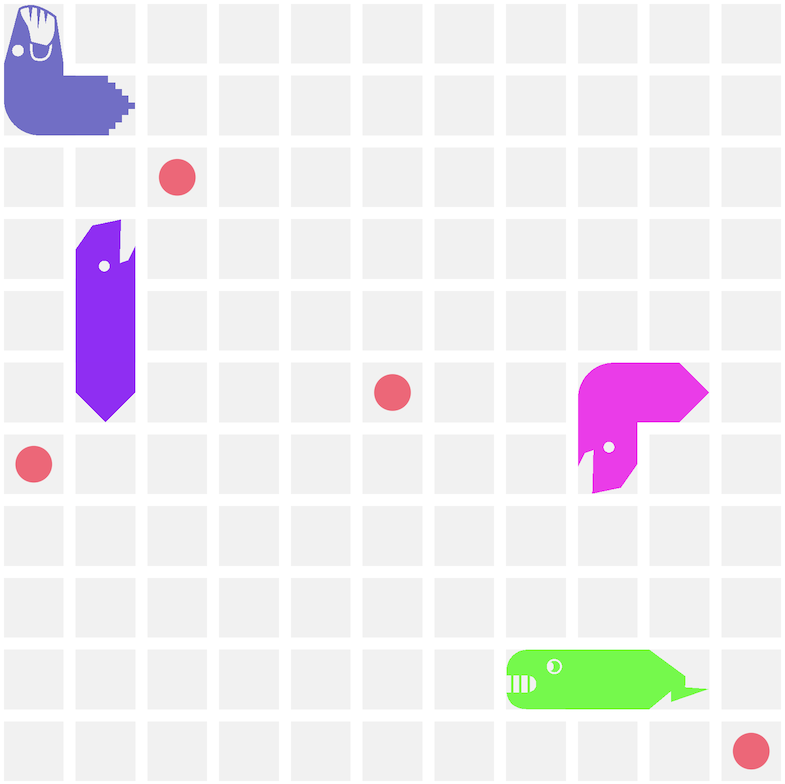
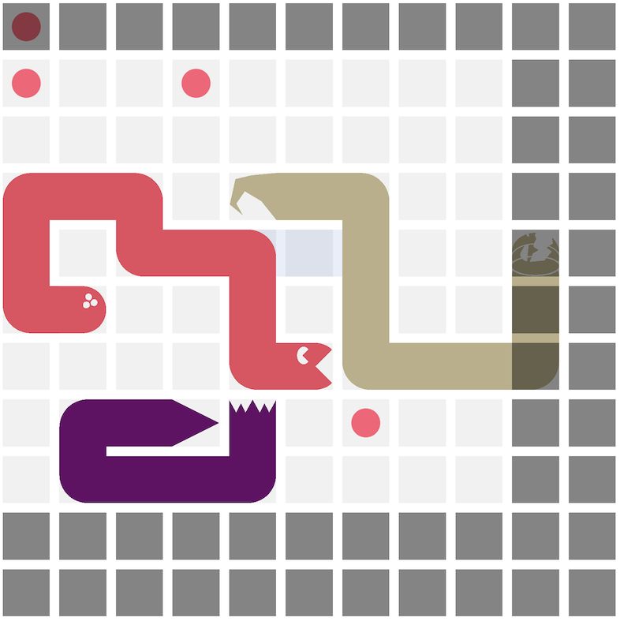
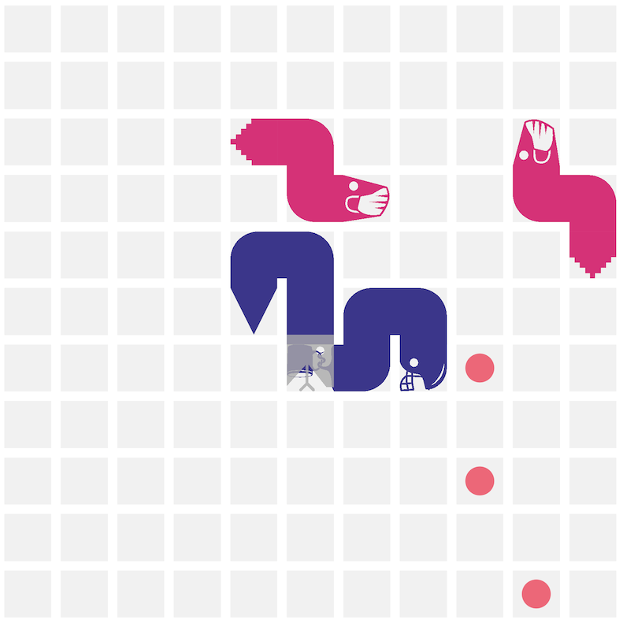
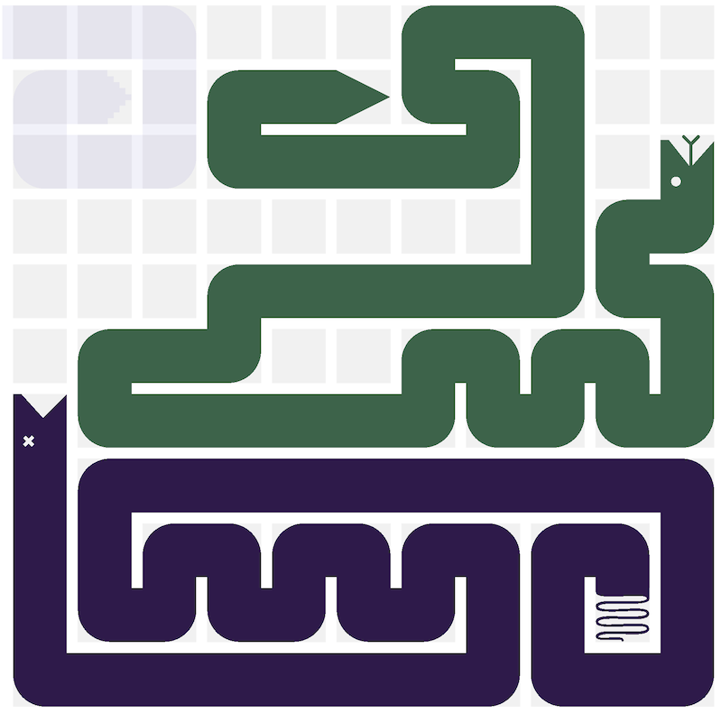

# Game Modes

Battlesnake has several game modes all built on the same foundational [game rules.](rules.md) All game modes and are available for casual play and may appear in competitions. In the API, the game mode is defined as the _ruleset_ on the [Game Object.](api/#game)

To play a specific mode, select the game mode at the top of the [Play Game](https://play.battlesnake.com/account/games/create/) page.

## Standard

A Standard Game is the original Battlesnake following the [game rules](rules.md) without modification.

Note that within a Standard Game the number of Battlesnake in the game can vary, and winning strategies for 1v1 games can be different than strategies for four or eight Battlesnakes.

There is a special type of standard game called 'solo', which consists of a \(usually\) standard game where your Battlesnake is the only Battlesnake on the board. This appears in manually created solo games and in many challenges.

## Royale

In a Royale Game, a new danger is introduced, commonly called 'Hazard Sauce'. The Hazard Sauce slowly enters on a random edge of the board consuming an entire row or column every few turns, shrinking the 'safe' zone. If the head of a Battlesnake is within the Hazard Sauce, its health points will more rapidly decline, loosing 15 health each turn. Food can and will spawn both inside and outside of the Hazard Sauce.

The location of hazardous squares are found in the API on the [board object](api/#board) listed under _hazards_, and are visible on the board as a darker-grey square.

## Squad

Squad Games have two or more Battlesnakes operating as a team against at least one other squad. At minimum there must be two Battlesnakes per Squad, and two Squads per game. Squads can consist of the same Battlesnake multiple times, or different Battlesnakes. Squads will be automatically colour-matched, but other customizations, such as head and tail, will remain.

Battlesnakes that are part of the same squad may overlap any part of their tail or body, but not their heads. Two snakes of the same squad with their heads in the same square will result in a head-on-head collision and the elimination of the squad.

When one Battlesnake in a squad consumes food, all Battlesnakes in that squad benefit from that food, increasing their length and refilling their health. In the event that multiple Squad members consume food on the exact same turn, the entire Squad will only grow by one length. If any single Battlesnake in a squad is eliminated, the entire squad is eliminated.

## Constrictor

In Constrictor mode, Battlesnake tails are 'pinned' at their starting location. The Battlesnake grows by one length every turn automatically, and its health points do not decrease. No food is spawned on the board during a constrictor game.

