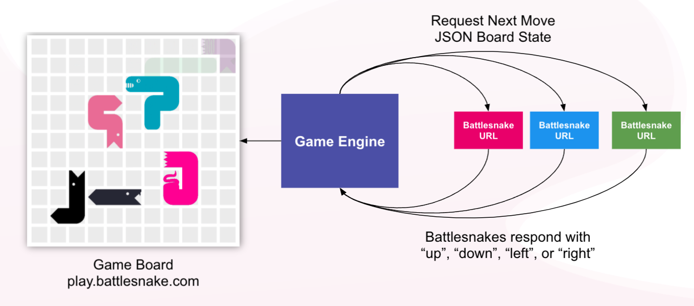

# Hosting Suggestions

Battlesnakes must be deployed to a publicly accessible web server so they can interact with the Battlesnake Game Engine. 



There are a number of online hosting solutions that can be used with your Battlesnake. Many of these services provide a free tier for new accounts. Some popular ones in the Battlesnake community include:

*  [Replit](https://replit.com/)
  * Handles both IDE and hosting see the [Quick Start Coding Guide](../guides/getting-started.md) for detailed instructions
  * Free tier is good for getting started
*  [Heroku](https://www.heroku.com/)
  * Handles hosting
  * Free tier provides up to 1,000 dyno hours/month
* [Amazon Web Services](https://aws.amazon.com/) 
  * Handles hosting, a more advanced choice 
  * Paid option only

Most of the [Starter Projects](https://docs.battlesnake.com/starter-snakes) have instructions for using [Heroku](https://heroku.com) or [Replit](https://replit.com/), which are great options if you are new to web development or uncomfortable deploying code to a live server on your own.

Successfully deploying your Battlesnake should provide you with a unique URL. Opening that URL in a browser should show your Battlesnake in action!


```text
{"apiversion": "1", "author": "BattlesnakeOfficial", "head": "default", "tail": "default", "color": "#888888"}
```


