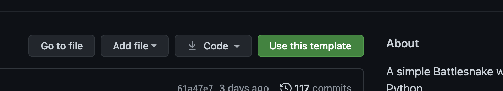

# Heroku

## Prerequisites

* A free ****[**Battlesnake Account**](https://play.battlesnake.com/)\*\*\*\*
* **A** [**GitHub Account**](https://github.com/) ****and [**Git Command Line**](https://www.atlassian.com/git/tutorials/install-git)\*\*\*\*
* A free ****[**Heroku Account**](https://signup.heroku.com/) and [**Heroku Command Line**](https://devcenter.heroku.com/categories/command-line)\*\*\*\*

These instructions assume you have already installed the Git Command Line and Heroku Command Line tools.

## **Step 1: Select a Starter Project**

Choose from the complete list of [**Starter Projects**](../starter-projects.md). The [**Official Starter Projects**](../starter-projects.md#official-starter-projects) have been tested and are maintained by the Battlesnake team.

For whichever Starter Project you choose, you will need to:

* Click the green **'Use This template'** button \(or if unavailable, make a [**fork of the repo**](https://docs.github.com/en/get-started/quickstart/fork-a-repo)\).



* \*\*\*\*[**Clone your repository**](https://help.github.com/en/github/creating-cloning-and-archiving-repositories/cloning-a-repository) into your local environment. Run the following in the console on your computer with your own GitHub username, and the language for whichever starter project you selected:

`git clone git@github.com:[YOUR-GITHUB-USERNAME]/starter-snake-[LANGUAGE].git`


If you are using a Community Starter Project, the name of the repository may be different, and might not start with `starter-snake-LANGUAGE.` Check the project repository to confirm the correct name for your command!


## Step 2: Create and run a Heroku App

To run your Battlesnake, [**Create a new Heroku App**](https://devcenter.heroku.com/articles/creating-apps) ****by running the following in the console on your local computer:

 `heroku create [YOUR-APP-NAME]`

The first URL in the output will be the URL where your Battlesnake will be run. You will need this URL in Step 3 to [**Register your Battlesnake**](../../guides/getting-started.md#step-4-register-your-battlesnake).


Check the [Language Support Page](https://devcenter.heroku.com/categories/language-support) if you are getting errors about versions when attempting to create or push your code to Heroku.


Once created, you can [**deploy your Battlesnake code to Heroku**](https://devcenter.heroku.com/articles/git#deploying-code) by running the command:

`git push heroku main`


If you are using a Community Starter Project, the mainline git branch might be different. Check the project repository to see if it is called `main`, `master`, or something else!


Now you can open your new Heroku app in your browser to see your Battlesnake running:

`heroku open`

If everything was successful, you should see response text that looks like this:

```text
{"apiversion": "1", "author": "", "color": "#ff0000", "head": "default", "tail": "default"}
```

Optionally, you can view your server logs using the Heroku log command. The `--tail` option will show a live feed of your logs in real-time.

`heroku logs --tail`

## Step 3: Register your Battlesnake

Using the URL from Step 2, follow the instructions to [**Register your Battlesnake**](../../guides/getting-started.md#step-4-register-your-battlesnake) on the Battlesnake website. With Heroku, that URL will look something like `https://my-app-name.herokuapp.com/` where _my-app-name_ is the name you used in Step 2.

Once your Battlesnake is registered, you should also follow the instructions to [**Create your First Game**](../../guides/getting-started.md#step-5-create-your-first-game) to test and verify that your Battlesnake is communicating successfully. Be sure to watch the logs of your server by running the `heroku logs --tail` command.

## Step 4: Making Changes and Updating your Battlesnake with Heroku

As you make changes to your Battlesnake code, you will need to make sure those changes get onto Heroku.

After making a code change, commit that change using git and then push it to your Heroku instance:

`git add .  
git commit -m "Message describing the change"  
git push heroku main`

Once Heroku has updated, you can [**create a new game**](https://play.battlesnake.com/account/games/create/) with your Battlesnake to view your latest changes in action.

Continue to make code changes and push those changes to your server using this pattern.


